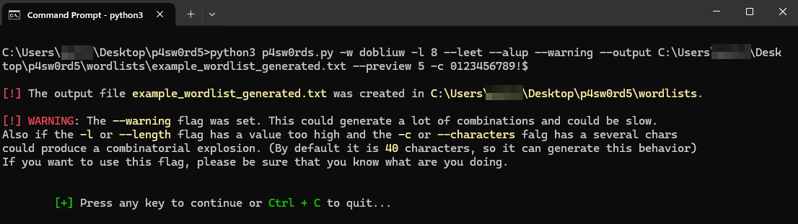
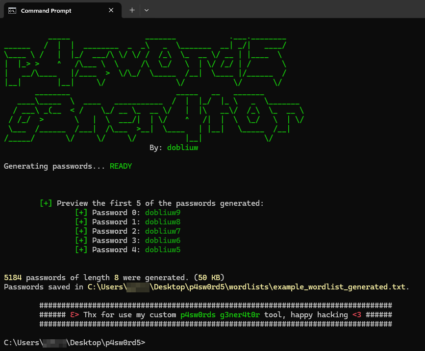

# 🛠️ What is P4sw0rds G3ner4t0r? 

**P4sw0rds G3ner4t0r** is a project born with the idea of having a personal tool for pentesting situations or moments in which it is necessary to carry out the creation of customized dictionaries based on words, names or information collected from more directed targets.

It is important to understand that it was developed for educational and offensive security awareness purposes. Any illegitimate use of it does not hold the creator responsible for the acts.

---
## 📦 Dependencies

- Python 3.8 or higher.
- Modules:
  - `termcolor`
  - Local Modules: `words_combination.py`, `leetspeak_parcial.py`, `alternate_lower_upper.py`, `size_format.py` and `loader.py`. (You can read the code before use this tool, I would do that for deranged lol).

The script makes use of the **termcolor** module for a nicer display on the command line:

- Install dependencies manually
```bash
pip install termcolor, hurry.filesize
```

- Install dependencies using the **requeriments.txt**:
```bash
pip install -r requeriments.txt
```

----
## ⚠️ Careful

Note that the **--warning** option will create all possible combinations based on the length specified with **--length**, which may cause problems with high *system resource consumption*.

As well as the use of many words (**-w** or **--words**) together with characters (**-c** or **--characters**) and/or a very large length (**-l** or **--length**) could also generate the same problems or *combinatorial explosion*.

---
## 📌 Usage example

Let's suppose we are performing a pentesting to a company that hired us for this exercise, a chain of gyms that recently migrated to a web intranet for the access of employees, customers and staff. In an initial reconnaissance phase, through **OSINT** and/or **social engineering** we were able to collect high-value data.

At this point, we have some specific data of the company, which has the name of **FitMarquez S.A**.

Some of the words that can be seen repeated in gymnasiums of this company are some like `fit`, `sport` and `gym`. The year of foundation is `2014` and the name of the owner is `Marquez`.

At this point, since the company did not provide us with network access credentials, we decided to generate a customized wordlist with the possibilities of these mixed words, with the option of using the typical techniques that can be used when creating a “strong” password such as the `Leet Speak` (also known as `eleet` or `Hacker Speech`) or typical mutations of upper and lower case, as well as adding different digits or signs depending on the length of credentials that we want to validate.

Once the **Handshake** is captured after scanning the network traffic, try to break by brute force a possible credential generated by this previous information gathering.

So... lets create this wordlist:

- Clone the repository
```bash
git clone https://github.com/Dobliuw/p4sw0rds_g3ner4t0r && cd p4sw0rds_g3ner4t0r
```

- Generate a wordlist
```bash
python3 p4sw0rds.py -w dobliuw -l 8 --leet --alup --warning --output C:\Users\dobliuw\Desktop\p4sw0rd5\wordlists\example_wordlist_generated.txt --preview 5 -c 0123456789!$
```


Explanation of each flag:

- `-w` or `--words`: String of words separated by comma (`,`) to combine. (Ex. **sport,fit** -> **sport**, **fit**, **sportfit**, **fitsport**).
- `-l` or `--length`: Desired length of credentials.
- `-c` or `--characters`: String of characters to complete credentials that do not have the desired length indicated.
	- `-l 10`, `-c 123` and `-w dobliuw` -> **dobliuw111**, **dobliuw112**, **dobliuw113** ....... **dobliuw333**.
- `--warning`: Generate all possible combinations ignoring possible hardware problems.
- `--leet`: Generate passwords using **Hacker Speech** technique. (Ex. **sport** -> **5port**, **sp0rt**, **spor7**, **5p0rt**, **5p0r7**).
- `--alup`: Generate passwords altering their upper and lower case characters. (Ex. **sport** -> **SpOrT**, **SPort**, **SPOrt**, **SporT**, **SPORT**, etc.).
- `--preview`: Indicate a number between **1** and **100** to see the first *N* passwords generateds like **output** in the *cli*.
- `-o` or `--output`: Indicate a **path** to dump the dictionary (**Include** the file name **.txt**)

At this point, the final dictionary would have been created in the default path `./wordlists/` with the example name `p4sw0rds_2025-05-01_11-11-11.txt` or the specified path, in this example `C:\Usersers_dobliuww\Desktop\p4sw0rd5\wordlists\example_wordlist_generated.txt` with the following stdout:



The final wordlist generated could be see it [here](./wordlists/example_wordlist_generated.txt).

----
## 📢Ethical Use Disclaimer

This tool has been developed exclusively for **educational**, **research**, and **authorized penetration testing** purposes. Its goal is to assist cybersecurity professionals in evaluating password strength, generating targeted wordlists for password audits, and training in realistic offensive security scenarios.

**Unauthorized use of this software against systems without explicit permission is illegal** and strictly prohibited. The developer assumes no responsibility for misuse or damage resulting from inappropriate or unethical deployment of this tool.

Please use responsibly, and always **obtain proper consent before testing** any system or service.

> 🛡️ _"With great power comes great responsibility."_ – Uncle Ben, and every ethical hacker.

Att. `Dobliuw` <3